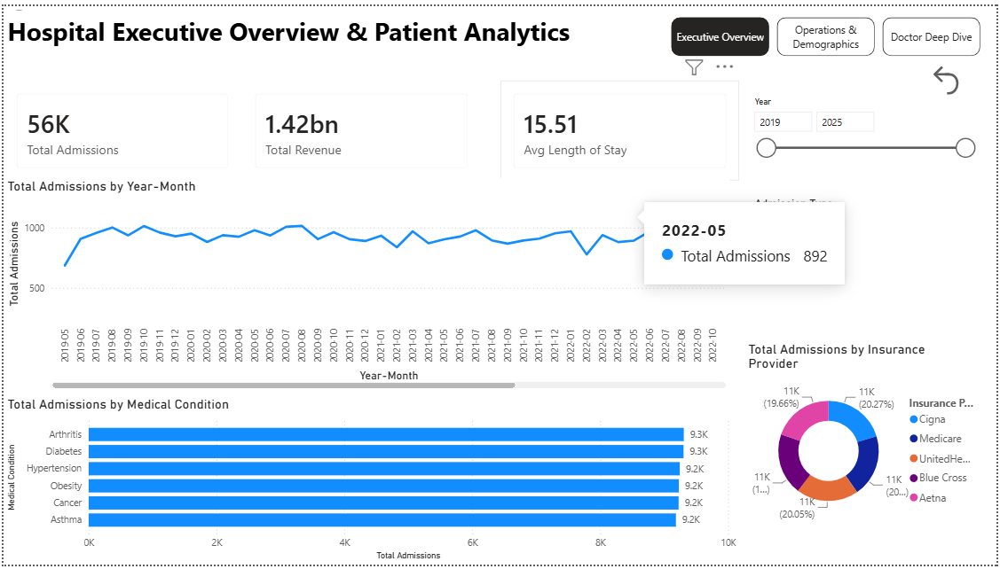
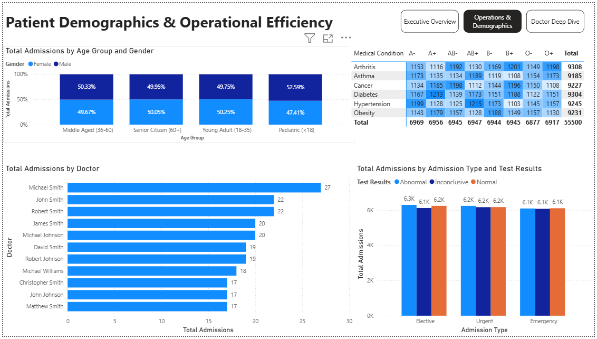

# 🏥 Healthcare Operations & Patient Analytics Dashboard

[](https://powerbi.microsoft.com/)
[](https://learn.microsoft.com/en-us/dax/)
[](https://learn.microsoft.com/en-us/power-query/)

An end-to-end, multi-page business intelligence solution built using **Microsoft Power BI** to analyze clinical throughput, resource allocation, diagnostic outcomes, and billing performance across **55,000+ patient admissions**.

---

## 📌 Executive Summary & Key KPIs

* **Total Patient Admissions:** 56,000 (56K)
* **Total Hospital Billing Incurred:** $1.42 Billion ($1.42B)
* **Average Length of Stay (ALOS):** 15.51 Days
* **Top Medical Conditions:** Arthritis, Diabetes, and Hypertension (~9.3K cases each)
* **Primary Payer Mix:** Balanced revenue share across Medicare, Cigna, UnitedHealthcare, Blue Cross, and Aetna (~20% each)

---

## 📊 Dashboard Visuals & Architecture

### Page 1: Executive Overview
High-level operational metrics, multi-year admission trends, clinical conditions, and insurance coverage splits.



* **KPI Header Cards:** Real-time visibility into Total Admissions, Total Billing, and Average Length of Stay.
* **Monthly Admission Trends:** Chronological line chart tracking patient admission volumes across multi-year cycles.
* **Condition Breakdown:** Ranked horizontal bar chart highlighting patient counts per clinical condition with data labels.
* **Insurance Payer Distribution:** Donut chart illustrating hospital billing reliance across major payers.
* **Interactive Controls:** Temporal range sliders, admission urgency filters, and single-click **Bookmark-driven Reset Buttons**.
* **Dynamic Hover Tooltip:** Hovering over condition bars triggers a miniature pop-up rendering specific stay durations and test result distributions.

---

### Page 2: Operations & Demographics
Operational resource planning, demographic breakdowns, doctor workloads, and diagnostic outcomes.



* **Age Group vs. Gender Mix:** 100% stacked column chart evaluating patient intake by demographic buckets.
* **Doctor Workload Matrix:** `Top N` filtered ranking displaying patient volume distribution among attending physicians.
* **Blood Bank Demand Matrix:** Cross-tab heatmap table with conditional background formatting linking Blood Types against Medical Conditions.
* **Diagnostic Outcomes Breakdown:** Clustered column chart assessing Normal, Abnormal, and Inconclusive test splits by admission classification.
* **Navigation Architecture:** Embedded page navigators enabling fluid web-like switching across views.

---

### Contextual Drill-Through: Doctor Deep Dive
Contextual right-click drill-down allowing management to isolate individual attending physicians and inspect complete historical patient records, billing totals, and discharge timelines.

---

## 🏗️ Architecture & Data Modeling

### 1. Data Cleaning & Transformation (Power Query ETL)
* Normalized text casings and cleared inconsistent categorical attributes.
* Scrubbed billing anomalies and validated primary key constraints.
* Enforced correct temporal data types across admission and discharge timestamps.

### 2. Star Schema Modeling
* Implemented a standard **Star Schema** to avoid bidirectional cross-filtering performance penalties.
* Established a **1-to-Many (1:*)** single-direction relationship connecting a dedicated `Dim_Date` table to the fact records (`healthcare_dataset`).
* Centralized all business metrics within an isolated `_Key Measures` table for production-level maintainability.

---

## ⚙️ Core DAX Formulations

### 1. Average Length of Stay (ALOS)
Calculates dynamic bed occupancy duration across filtered dimensions:
```dax
Avg Length of Stay = 
AVERAGEX(
    'healthcare_dataset', 
    DATEDIFF('healthcare_dataset'[Date of Admission], 'healthcare_dataset'[Discharge Date], DAY)
)
